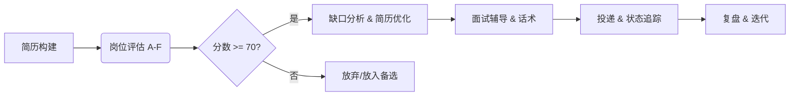

# 🎯 Career Engine - 智能求职自动化系统

<div align="center">

[English Documentation](README_EN.md) | [中文文档](README.md)

**CN**: 基于 career-ops 重建的求职决策引擎。集成 A-F 岗位评分、STAR+R 简历构建、JD 缺口分析、全场景面试辅导及投递追踪。零依赖架构，精准过滤噪音，锁定高价值机会。

**EN**: Rebuilt from career-ops: A-F job scoring, STAR+R resume builder, gap analysis, interview coaching & tracking. Zero dependencies. Filter noise, win dream roles.

[](https://python.org)
[](https://sqlite.org)
[](LICENSE)
[](https://github.com/career-ops/career-ops)

</div>

---

## 📋 1. 设计目的 (Design Purpose)

**CN**:
在当今求职市场，公司用 AI 筛选简历，求职者却还在手动海投。
**Career Engine** 将"求职"从体力劳动升级为**数据驱动的决策工程**。它不仅仅是一个简历生成器，更是一个"反向过滤器"——利用 A-F 多维评分模型帮你识别并过滤掉 90% 的不匹配岗位，将精力集中在真正值得投入的机会上。
我们坚持 **Human-in-the-Loop**（人在回路）：AI 负责数据评估与准备，人类负责最终决策。

**EN**:
Companies use AI to filter candidates. Why aren't candidates using AI to choose companies?
**Career Engine** turns job hunting from manual labor into **data-driven decision engineering**. It is not just a resume generator, but a "reverse filter"—using an A-F multi-dimensional scoring model to identify and filter out 90% of mismatched roles, focusing your energy on opportunities that truly matter.
We adhere to **Human-in-the-Loop**: AI handles evaluation and preparation; humans make the final decisions.

---

## 👥 2. 目标群体 (Target Audience)

| 群体 (Audience) | 应用场景 (Use Case) |
| :--- | :--- |
| **求职者 / Job Seekers** | 简历优化、岗位匹配度评估、模拟面试准备 |
| **职业顾问 / Career Counselors** | 为客户提供结构化评估报告、追踪辅导进度 |
| **开发者 / Developers** | 作为 AI Agent 的 Skill 加载，集成到现有工作流 |

---

## 🛠️ 3. 技术架构 (Tech Stack)

| 层级 | 技术 | 说明 |
| :--- | :--- | :--- |
| **核心逻辑** | Python 3.7+ | 纯标准库实现，零外部依赖 (Pure Standard Lib) |
| **数据存储** | SQLite | 12 张分级表 + 索引，单机高性能 |
| **AI 集成** | Skill 接口 | 支持 Claude, Cursor, Hermes 等 AI 助理直接加载 |
| **自动化** | Playwright (可选) | 用于 BOSS 直聘等平台的岗位采集 |

---

## 🧬 4. Career-Ops 解构设计 (Deconstruction of Career-Ops)

本项目解构了 [career-ops](https://github.com/career-ops/career-ops) 的核心方法论，进行了以下架构升级：

| 特性 | Career-Ops (原版) | Career Engine (升级版) |
| :--- | :--- | :--- |
| **核心驱动** | Prompts (依赖 Claude Code) | **Python 代码** (通用逻辑) |
| **数据存储** | Markdown / TSV | **SQLite** (结构化 + 关联查询) |
| **平台适配** | Greenhouse / Ashby (海外) | **BOSS / 智联 / LinkedIn / 领英** (全球+国内) |
| **面试辅导** | ❌ | ✅ 话术生成 + 模拟面试 + 复盘 |
| **依赖环境** | 仅限 Claude Code 终端 | **任何 Python 环境** + AI 助理 |
| **评分体系** | A-F (Prompt 判断) | **8 维度加权算法** (可量化) |

---

## 🔄 5. 工作流程 (Workflow)



1.  **Build**: 交互式 Q&A 构建 STAR 结构简历。
2.  **Score**: 输入 JD，自动输出评分报告 (Match/Impact/Comp 等 8 维度)。
3.  **Optimize**: 针对高分岗位，生成定制化简历和关键词建议。
4.  **Coach**: 生成 HR/技术/经理面试话术，提供模拟面试。
5.  **Track**: 管理投递漏斗，监控转化率。

---

## 🤖 6. 适配范围 (Compatibility)

本项目设计为**通用 AI Skill**，可被任何支持 Python 执行或文件读取的 AI 助理加载：

-   **Hermes Agent**: 直接作为 `~/.hermes/skills/career-engine` 加载。
-   **Claude Code / Cursor**: 配置为 Tool/Skill 或直接运行 CLI。
-   **通用终端**: 作为标准 Python 脚本运行 (`python scripts/cli.py ...`)。

---

## 📦 7. 安装方法 (Installation)

### 方式 A: 作为 AI Skill 安装 (推荐)
直接将 `career-engine` 文件夹复制到你的 AI 助理 Skill 目录中。
```bash
cp -r career-engine /path/to/your/agent/skills/
```

### 方式 B: 独立运行 (CLI 模式)
无需安装任何依赖（仅需 Python 环境）。
```bash
git clone https://github.com/mage0535/career-engine.git
cd career-engine

# 1. 初始化数据库
python3 scripts/cli.py init

# 2. 启动交互式简历构建
python3 scripts/interactive_builder.py

# 3. 评估一个岗位
python3 scripts/cli.py evaluate "高级后端工程师... (粘贴完整 JD)"
```

---

## 🙏 致谢 (Acknowledgements)

本项目的核心灵感与评分模型方法论来源于 **[Career-Ops](https://github.com/career-ops/career-ops)** 项目。
感谢原作者将这一先进的求职理念开源。本项目在保留其核心哲学 (Not spray-and-pray) 的基础上，进行了底层架构的通用化重写与国内本土化适配。

---

## 📄 License

MIT License
