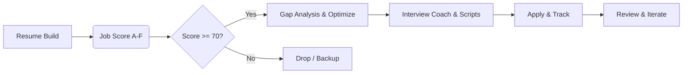

# 🎯 Career Engine - Enterprise Job Search Automation System

<div align="center">

[English Documentation](README_EN.md) | [中文文档](README.md)

**CN**: 基于 career-ops 重建的求职决策引擎。集成 A-F 岗位评分、STAR+R 简历构建、JD 缺口分析、全场景面试辅导及投递追踪。零依赖架构，精准过滤噪音，锁定高价值机会。

**EN**: Rebuilt from career-ops: A-F job scoring, STAR+R resume builder, gap analysis, interview coaching & tracking. Zero dependencies. Filter noise, win dream roles.

[](https://python.org)
[](https://sqlite.org)
[](LICENSE)
[](https://github.com/career-ops/career-ops)

</div>

---

## 📋 1. Design Purpose

In today's job market, companies use AI to filter resumes, yet job seekers are still manually applying to hundreds of roles.
**Career Engine** upgrades job hunting from manual labor to **data-driven decision engineering**. It is not just a resume generator, but a "reverse filter"—using an A-F multi-dimensional scoring model to help you identify and filter out 90% of mismatched roles, focusing your energy on opportunities that truly matter.
We adhere to **Human-in-the-Loop**: AI handles evaluation and preparation; humans make the final decisions.

---

## 👥 2. Target Audience

| Audience | Use Case |
| :--- | :--- |
| **Job Seekers** | Resume optimization, job matching evaluation, mock interview preparation |
| **Career Counselors** | Provide structured evaluation reports for clients, track coaching progress |
| **Developers** | Load as an AI Agent Skill, integrate into existing workflows |

---

## 🛠️ 3. Tech Stack

| Layer | Technology | Description |
| :--- | :--- | :--- |
| **Core Logic** | Python 3.7+ | Pure standard library implementation, **Zero External Dependencies** |
| **Data Storage** | SQLite | 12 hierarchical tables + indexes, high-performance local DB |
| **AI Integration** | Skill Interface | Supports direct loading by Claude, Cursor, Hermes, etc. |
| **Automation** | Playwright (Optional) | Used for job scraping on platforms like BOSS Zhipin |

---

## 🧬 4. Deconstruction of Career-Ops

This project deconstructs the core methodology of [career-ops](https://github.com/career-ops/career-ops) and introduces the following architectural upgrades:

| Feature | Career-Ops (Original) | Career Engine (Upgraded) |
| :--- | :--- | :--- |
| **Core Driver** | Prompts (Depends on Claude Code) | **Python Code** (Universal Logic) |
| **Data Storage** | Markdown / TSV | **SQLite** (Structured + Relational) |
| **Platform Adapt** | Greenhouse / Ashby (Overseas) | **BOSS / Zhilian / LinkedIn** (Global + China) |
| **Interview Coach** | ❌ | ✅ Scripts + Mock Interviews + Review |
| **Dependencies** | Claude Code Terminal Only | **Any Python Env** + AI Agents |
| **Scoring System** | A-F (Prompt Judgment) | **8-Dim Weighted Algo** (Quantifiable) |

---

## 🔄 5. Workflow



1.  **Build**: Interactive Q&A to build STAR-structured resumes.
2.  **Score**: Input JD, automatically output scoring report (Match/Impact/Comp, etc.).
3.  **Optimize**: Generate customized resumes and keyword suggestions for high-scoring roles.
4.  **Coach**: Generate HR/Tech/Manager interview scripts, provide mock interviews.
5.  **Track**: Manage the application funnel and monitor conversion rates.

---

## 🤖 6. Compatibility

Designed as a **Universal AI Skill**, it can be loaded by any AI assistant that supports Python execution or file reading:

-   **Hermes Agent**: Directly load as `~/.hermes/skills/career-engine`.
-   **Claude Code / Cursor**: Configure as a Tool/Skill or run CLI directly.
-   **Standard Terminal**: Run as standard Python scripts (`python scripts/cli.py ...`).

---

## 📦 7. Installation

### Method A: Install as AI Skill (Recommended)
Simply copy the `career-engine` folder to your AI agent's skill directory.
```bash
cp -r career-engine /path/to/your/agent/skills/
```

### Method B: Standalone Run (CLI Mode)
No dependencies required (just Python environment).
```bash
git clone https://github.com/mage0535/career-engine.git
cd career-engine

# 1. Initialize Database
python3 scripts/cli.py init

# 2. Start Interactive Resume Builder
python3 scripts/interactive_builder.py

# 3. Evaluate a Job
python3 scripts/cli.py evaluate "Senior Backend Engineer... (paste JD)"
```

---

## 🙏 Acknowledgements

The core inspiration and scoring model methodology of this project come from the **[Career-Ops](https://github.com/career-ops/career-ops)** project.
Special thanks to the original author for open-sourcing this advanced job search concept. This project retains its core philosophy (Not spray-and-pray) while rewriting the underlying architecture for generalization and localization.

---

## 📄 License

MIT License
